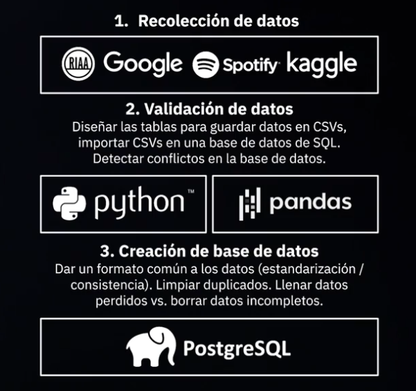
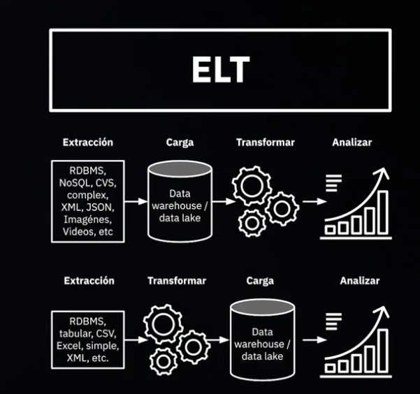

# Curso de ETL con Python y Pentaho. Platzi

En este curso se aprendera como realizar un ETL.  

Proceso de ETL desde fuentes:

  

## 1. Conceptos base de las ETL:

1. Source:  
Estas son las fuentes de donde voy a obtener los datos.
2. Target:  
El target es donde voy a almacenar la informacion ya extraidos y transformados.  
3. Staging:  
Son donde van a reposar las transformaciones para luego cargarlas.  
4. Data Warehouse:  
Los datawarehouse son los almacenes de datos.  
5. Modelo Estrella:  
Los modelos estrella es donde van a estar las dimensiones claves para el negocio.  
6. Data lake:  
Se vuelve un filesystem donde van a estar la data guardada de diferentes formas sin un proceso de transformacion.
7. ELT:  
  

## 2. Consideraciones de ETL  
Lo primero a considerar son la calidad de los datos. Luego, como van a ser los cargues de informacion. Ahi es definir si van a ser en batch o en streaming. Es decir, que en batch siempre tengo un delta. Por su parte debo tener claro para streaming que debe durar menos de un segundo.   

Por otro lado, tambien pensar si es carga incremental o carga total.  

